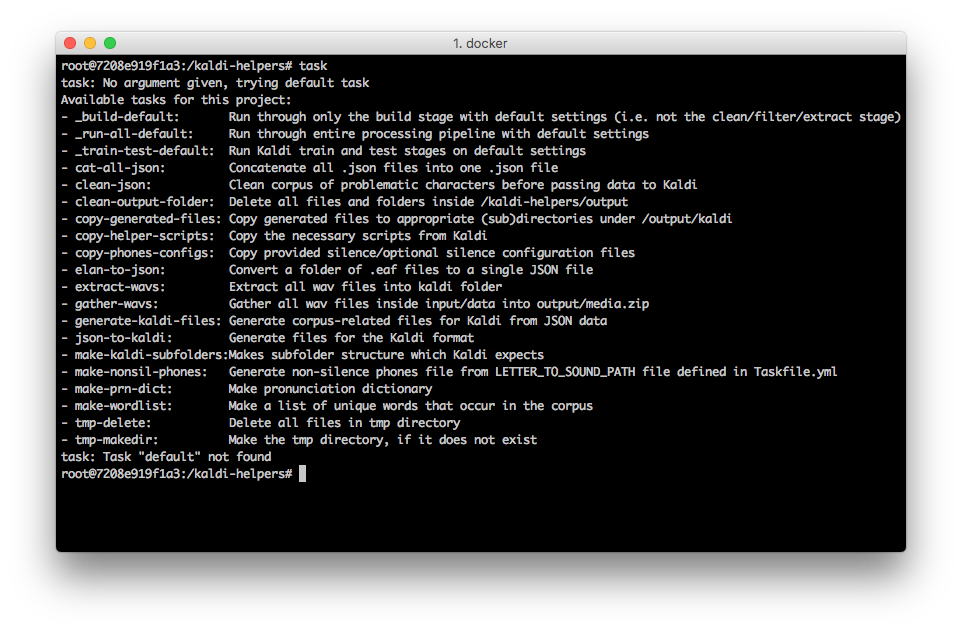

# Setting up Kaldi using Docker

## Install Docker

- OS X: [https://docs.docker.com/docker-for-mac/install/](https://docs.docker.com/docker-for-mac/install/)
- Windows: [https://docs.docker.com/docker-for-windows/install/](https://docs.docker.com/docker-for-windows/install/)
- Linux (Ubuntu): [https://docs.docker.com/engine/installation/linux/ubuntu/](https://docs.docker.com/engine/installation/linux/ubuntu/)

## Start the Docker app

Once the Docker daemon is running, open up a Terminal/Command Prompt window and type:

```
docker --version
```

## Pull the `coedl/kaldi-helpers` container

```
docker pull coedl/kaldi-helpers:0.2
```

***Note.*** The `:0.2` following `coedl/kaldi-helpers` indicate the version number of the Docker image.

## Run the docker image

```
docker run -it --rm coedl/kaldi-helpers:0.2 /bin/bash
```

## Run the `task` command inside the Docker image

Running the `task` command inside the `coedl/kald-helpers` image shows a list of helper tasks available.



See `/corpora/abui_toy_corpus` and `/corpora/komnzo-toy_corpus` in this repository on how to use these helper tasks to prepare corpus data for use with Kaldi.


