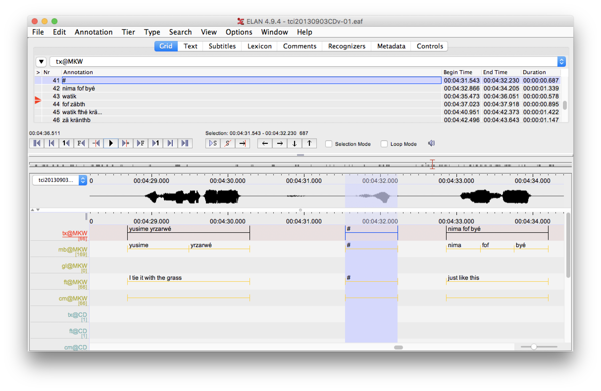

# Komnzo 'Toy' Corpus

The Komnzo toy corpus gives an example of running a customised build pipeline using the kaldi-helpers toolkit. We'll assume that you've already gone through the more basic example of the Abui Toy Corpus before starting this example.

## data

The Komnzo toy corpus gives a more realistic example of data to be processed. Notice in particular the `#` item highlighted below, and that there are multiple tiers within the .eaf file (`tx@MKW`, `gl@MKW`, etc.).

The data from these ELAN files will first need to be filtered and cleaned before they are similar to those in the Abui Toy Corpus example. Only then can we use the default build pipeline.



## `komnzo-custom-build.sh`

### Usage

The file `komnzo-custom-build.sh` specifies a custom build pipeline, re-purposing various helper tasks to filter and clean the data. To run the script inside the `coedl/kaldi-helpers` Docker image, we can use the command:

```bash
src
# to the appropriate path for your computer

docker run --rm \
           -v ~/git-repos/coedl/kaldi-helpers/corpora/komnzo-toy_corpus/:/kaldi-helpers/input \
           coedl/kaldi-helpers:0.1 \
           bash input/komnzo-custom-build.sh
```

***Note.*** See the `docker run` explanation in `/corpora/abui_toy_corpus/README.md` if you have not see the `-v` mount option before.

### Explanation

#### Data cleaning and filtering

```bash
# Extract all tiers from ELAN files

## Note the output file path: remember that this script is being called
src
task elan-to-json > /kaldi-helpers/input/output/tmp/komnzo_all.json

# Select text tiers (starting with tx@), and filter out annotations
# with non-conforming characters
cat input/output/tmp/komnzo_all.json \
	| jq 'map(select(.tier | startswith("tx@")))
	| map(select(.transcript | contains(".") == false))
	| map(select(.transcript | contains(",") == false))
	| map(select(.transcript | contains("#") == false))
	| map(select(.transcript | contains("-") == false))
	| map(select(.transcript | contains("\"") == false))' > /kaldi-helpers/input/output/tmp/komzo_tx_only.json

```

Notice that this script uses the `elan-to-json` task to read in all data from all tiers, and saves the data to the `komnzo_all.json` file. It then uses `jq` to filter out all data not from a tier starting with `tx@`, and data which contain unacceptable characters, such as `#`.

#### Customising the build pipeline

Now that the Komnzo toy data are in a similar shape to the Abui toy data, we can run the default pipeline. However, we will need to specify that the pipeline should read from the file we had just created, and also that the `.wav` files provided are at a different sample frequency to the default assumed (48000 Hz instead of 44100 Hz; see `/Taskvars.yml` for all default settings).

```bash
CLEANED_FILTERED_DATA=komzo_tx_only.json \
	MFCC_SAMPLE_FREQUENCY=48000 \
	task _build-default
```
